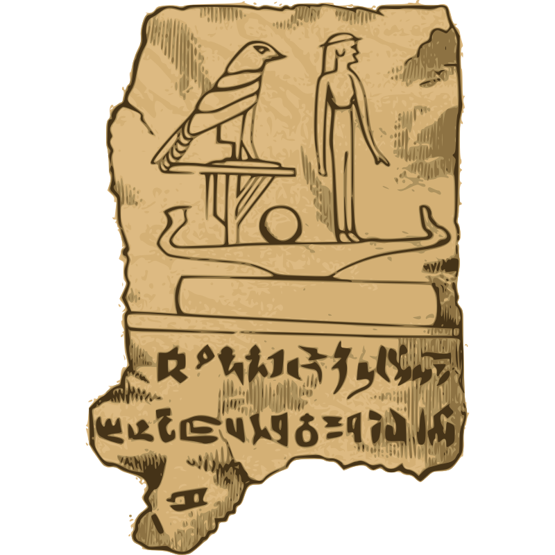

  
  

  

    <b> List of awesome Egyptian things for developers. 📜</b>
     
  

  

   

> Note: 
📕 - For academic content

### Contents

- [Contents](#contents)
- [Communities](#communities)
- [Events](#events)
- [Blogs](#blogs)
- [Podcasts](#podcasts)
- [YouTube Channels](#youtube-channels)
- [Community Projects](#community-projects) 

### Communities
- [Egyptian Geeks](https://www.facebook.com/groups/egyptian.geeks/) - Join, share, and network with tech enthusiasts and professionals from Egypt.
- [Egypt JS](https://www.meetup.com/egyptjs/) - Connect with JavaScript developers for frontend, backend, mobile, VR, and hardware development.
- [Cairo C++ Meetup](https://www.meetup.com/cairo-c-c-meetup-group/) - Cairo C++ Meetup Group is for professionals and beginners interested in C++/C, exchange of experience and networking.
- [Embedded Meetup](linkedin.com/company/embeddedmeetup) - Enabling the collaboration between technology hubs, industry experts,  and entrepreneurs will offer better opportunities for individuals and the whole ecosystem.
- [Backend Builders](https://x.com/BackendBuilders) - A thriving community of backend developers to connect, learn, and inspire together.
- [BLEU](discord.gg/sjU9VCT3h4) - A community for Arab programmers on Discord, hosting virtual meetups on various topics.
- [Active Courses](https://discord.gg/M7U9qBB9yp) - A Discord server focused on self-study on various technical topics.

### Podcasts

- [Mohamed Elsherif ](https://www.youtube.com/@bashmohandes) - Software Engineering topics and discussions, podcast and some times video tutorials.
- [Ahmed Elemam](https://www.youtube.com/@ahmdelemam) - Arabic videos for Software Engineers.
- [قهوة عصام](https://www.youtube.com/@essamcafe) Software topics, more focused on career and personal experiences rather than specific technical deep dives.
- [null++](https://nullplus.plus/) - Null++ is an Arabic podcast powered by Cairo's Facebook Developers Circle Co-Leads, delivering valuable insights for MENA's software professionals to advance their careers
- [Tech and Coffe](https://www.youtube.com/@tech.and.coffee) - oin a community of tech enthusiasts enjoying premium coffee culture while delving into IT over lattes.
- [سكيورتي بالعربي ](https://music.youtube.com/playlist?list=PLTZJNA1ULApUyLKgMFwxO5n6LlbekKOL2) - non-profit podcast promoting cybersecurity content in Arabic. 
- [untyped.fm](https://untyped.fm/) - Weekly 30-45 minute episodes on Frontend and JavaScript in Arabic.
- [CodeCast - كودكاست](https://youtube.com/playlist?list=PLsqPSxnrsWLuE-O3IKIUWy6Hmelz3bMWy) - Arabic videos with valuable egyptian speakers.

### Blogs

- [Ahmed Ghazey](https://ahmedghazey.medium.com/) - Seasoned Senior Staff Software Engineer with a proven track record of delivering complex software solutions, managing teams, and providing technical leadership.
- [Mahmoud Salem](https://hashnode.com/@mahsayedsalem) - Software Engineer with experience in building, scaling and maintaining web applications.
- [Sayed Alesawy](https://sayedalesawy.hashnode.dev/) - Lead Software Engineer, passionate about large-scale server-side applications and distributed systems.
- [Eqraatech - إقرأ تك](https://eqraatech.com/) - Contains Arabic blogs that cover several topics in software engineering.

### Community Projects

- [egytech.fyi](https://egytech.fyi/) - Providing Egyptian tech professionals with clear salary data and career insights.
- [Stack Info](https://stackinfo.me/) - Stack Info allows you to explore and find tech stacks used by more than 300 startups and corporates in EMEA.

### YouTube Channels

- [Ahmed Farghal](https://www.youtube.com/@asoli_dev) - Ahmed, aka asoli, ex-Meta and ex-Stripe staff engineer with 20 years in tech. Hybrid software/SRE engineer, cook, and engineering enthusiast. Content is independent of employers.
- [TechVault](https://www.youtube.com/@TechVault_) - Sharing in-depth tech-related knowledge, including both technical and career-related subjects, for both Arabic- and English-speaking viewers. Presented by Amr Elhelw.
- [Emad Elsaid](https://www.youtube.com/@EmadElsaid) - He is a software engineer, casual gamer, and science fiction fan. He provides live coding sessions in Go and career advice.
- [بالعربي Big Data](https://www.youtube.com/@bigdata4756) - An educational channel explaining technical topics related to Big Data in Arabic.
- [Sharno](https://www.youtube.com/@msharno) - Software developer who likes to always try new languages (especially functional), and also gives sessions about Rust, Java, and functional programming.
- [Gitunleashed](https://www.youtube.com/@gitunleashed) - Your ultimate guide to mastering Git and becoming a version control expert. From beginner basics to advanced techniques, we demystify Git with clear tutorials and practical examples. Join us on a journey to optimize your workflow, handle complex projects, and collaborate effectively. Unleash the power of Git with GitUnleashed.
- [Ameer Gaafar](https://www.youtube.com/@AmeerGaafar) - Ameer is an ex-Engineering Manager at Google, and he creates great content about TDD.
- [Arabic Competitive Programming](https://www.youtube.com/@ArabicCompetitiveProgramming) - Mostafa Saad Ibrahim is a competitive programming World Finalist (2011) and former TA at Cairo University (2009-2014). He holds a Ph.D. in Computer Vision from SFU (2018) and covers topics such as programming, OOP, data structures, and algorithms.
- [Elzero Web School ](https://www.youtube.com/@ElzeroWebSchool) - It is a channel that offers multiple web development tracks and general programming learning through detailed interactive explanations in Arabic. It provides study plans with coding tests and challenges to ensure understanding and practical application of the code.
- [Yallacode](https://www.youtube.com/@yallacode_) - Yallacode is an organization that provides developer support in Arabic
- [Omar Morsy](https://www.youtube.com/@omarmorsy02) - YouTube sessions on algorithms, MOOC interviews.
- [Youssef Hosni](https://www.youtube.com/@YoussefHosni95) - Youssef Hosny is a data scientist and researcher in the field of machine learning. He has over five years of experience in data science and machine learning, and their applications in the medical field, marketing, and e-commerce.
- [Software ArchTalks for Arabs](https://www.youtube.com/@ArabSoftwareArchTalks) - Distributed Systems, Microservices, API Design and Managment, Domain Driven Design, etc.
- [Mahmoud Youssef - محمود يوسف](https://www.youtube.com/@mahyoussef) - Software Engineering in Arabic.
- [درة الاكواد لابن حماد](https://www.youtube.com/@quantum01010101/playlists) - Declarative Programming.
- [محمد يحيى](https://www.youtube.com/@firefoxegyweb) - Web Development, Design Patterns and Best Practices
- [Omar Ahmed](https://www.youtube.com/@OmarAhmedx14) - Java, Clean Code, OOP, Flutter, etc.
- [Cloud with Moe](https://www.youtube.com/@cloudwithmoe) - This channel focuses on Arabic videos designed to help you learn new Cloud Skills and improve your career.    
- [pragma](https://www.youtube.com/@pragma-ar) - Yasser, with experience in the software industry since 2010, has worked at companies like Microsoft and Google, along with smaller startups. This channel discusses the software industry, clean code, software design, tooling, and related topics.
- [Ahmed Fathi](https://www.youtube.com/@noone988-Ahmed-Fathi) - This is a computer engineering related channel in Arabic where he explains various topics
- [Amsheer WaBasheer](https://www.youtube.com/@AmsheerWaBasheer) - This is a computer engineering related channel in Arabic where he explains various topics.
- [php anonymous](https://www.youtube.com/@PhpAnonymous/playlists) - PHP, DenoJS, Laravel Courses.
- [📕 Ayman Bahaa-Eldin](https://www.youtube.com/@aymanbahaa-eldin1141) - He offers recorded courses in networking and information security.
- [📕 Dr. Ahmed Hagag](https://www.youtube.com/@dr.ahmedhagag) - The channel provides simplified explanations of some subjects relevant to undergraduate students in Computer Science, Artificial Intelligence, Mathematics, and Software Engineering.
- [📕 Dr Magdi Amer](https://www.youtube.com/@DrMagdiAmer) - Dr. Magdy Amer, with over 35 years of programming consultancy experience, plans to offer Arabic courses on Java, OOP, Cloud, SQL, No SQL, Kafka, WebFlux, Spring, and more.
- [📕 Dr Mervat Mikhail](https://www.youtube.com/@DrMervatMikhail) - Lecturer at Alexandria University's Faculty of Engineering, providing courses in Data Structures, Algorithms, and Mathematics. 
- [📕 Dr Hicham Elmongui](https://www.youtube.com/@elmongui76) - Lecturer at Alexandria University's Faculty of Engineering, providing courses in Databases, Operating systems, Networks, and Distributed systems. 
- [📕 Dr. Ibrahim Gomaa](https://www.youtube.com/@dr.ibrahimgomaa6862) - Networks and Networks Security.
- [Ahmed Ibrahim](https://www.youtube.com/@ai1998) - This channel contains 5 courses (Machine learning, deep learning, computer vision, NLP, Raspberry pi), the order of AI courses [`check comments`](https://www.linkedin.com/posts/ahmed-ibrahim-93b49b190_%D8%A8%D9%8A%D8%AC%D9%8A%D9%84%D9%8A-%D8%A7%D8%B3%D8%A3%D9%84%D9%87-%D9%88%D8%AA%D8%B9%D9%84%D9%8A%D9%82%D8%A7%D8%AA-%D9%83%D8%AA%D9%8A%D8%B1-%D8%AD%D9%88%D9%84-%D8%AA%D8%B1%D8%AA%D9%8A%D8%A8-%D8%A7%D9%84%D9%85%D8%AD%D8%AA%D9%88%D9%8A-activity-7309955054411636739-6su8/).
